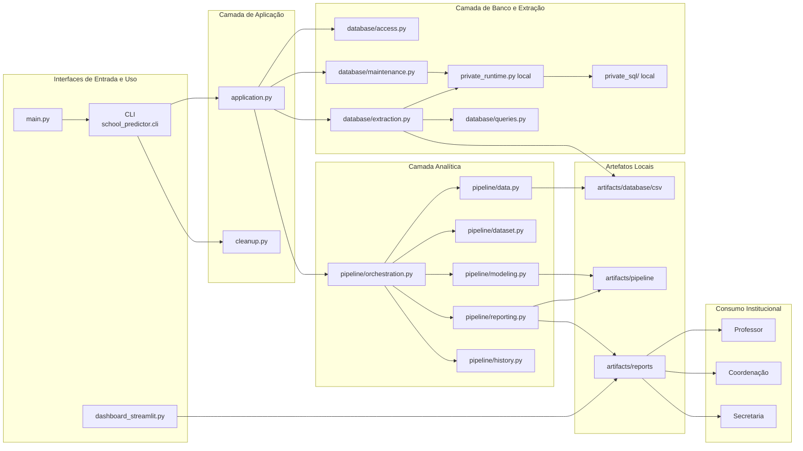

# Arquitetura da Solução

Este diagrama representa a estrutura estática da solução, destacando os blocos principais, suas responsabilidades e dependências, sem focar na sequência de execução.

## Leitura rápida

- `school_predictor/` concentra a aplicação ativa.
- a camada privada local protege SQL real e rotinas sensíveis do banco.
- `artifacts/database/csv` é a interface de entrada pública da pipeline.
- `artifacts/pipeline` guarda os resultados técnicos dos modelos.
- `artifacts/reports` guarda as saídas operacionais consumidas pela escola e pelo dashboard.
