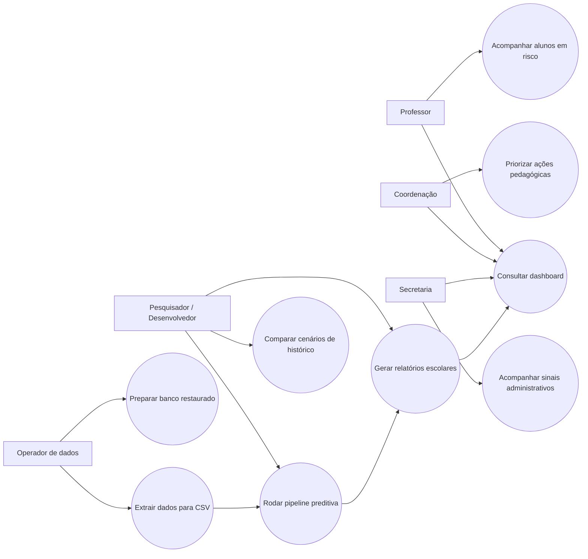

# Casos de Uso

Este diagrama mostra quem interage com a solução e quais objetivos cada perfil tem dentro do projeto.

## Leitura rápida

- o operador técnico mantém o banco e a extração dos dados.
- o pesquisador ou desenvolvedor usa a CLI para rodar e avaliar a pipeline.
- professor, coordenação e secretaria consomem o resultado final por relatórios e dashboard.
- cada perfil usa a solução com uma finalidade diferente, mesmo partindo da mesma base analítica.
