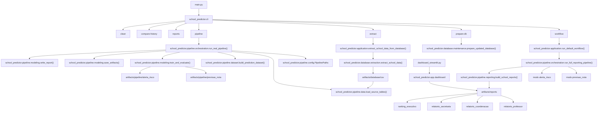

# Diagrama Arquitetural

Este diagrama resume a arquitetura atual do projeto, mostrando a separacao entre entrada operacional, camada de banco, pipeline analitica, artefatos e consumo final.

## Leitura rapida

- `main.py` chama a CLI principal do projeto.
- `school_predictor.cli` organiza os comandos operacionais: preparar banco, extrair dados, rodar pipeline, gerar relatorios e limpar artefatos.
- `database/` concentra manutencao do banco e extracao dos dados brutos.
- `artifacts/database/csv` guarda os CSVs extraidos do banco.
- `pipeline/` concentra leitura dos CSVs, engenharia de atributos, treino, avaliacao e relatorios tecnicos.
- `run_full_reporting_pipeline()` executa os dois modos centrais: `previsao_nota` e `alerta_risco`.
- `reporting.py` consolida as saidas da modelagem em relatorios voltados para professor, coordenacao e secretaria.
- `dashboard_streamlit.py` consome os artefatos finais de `artifacts/reports`.
