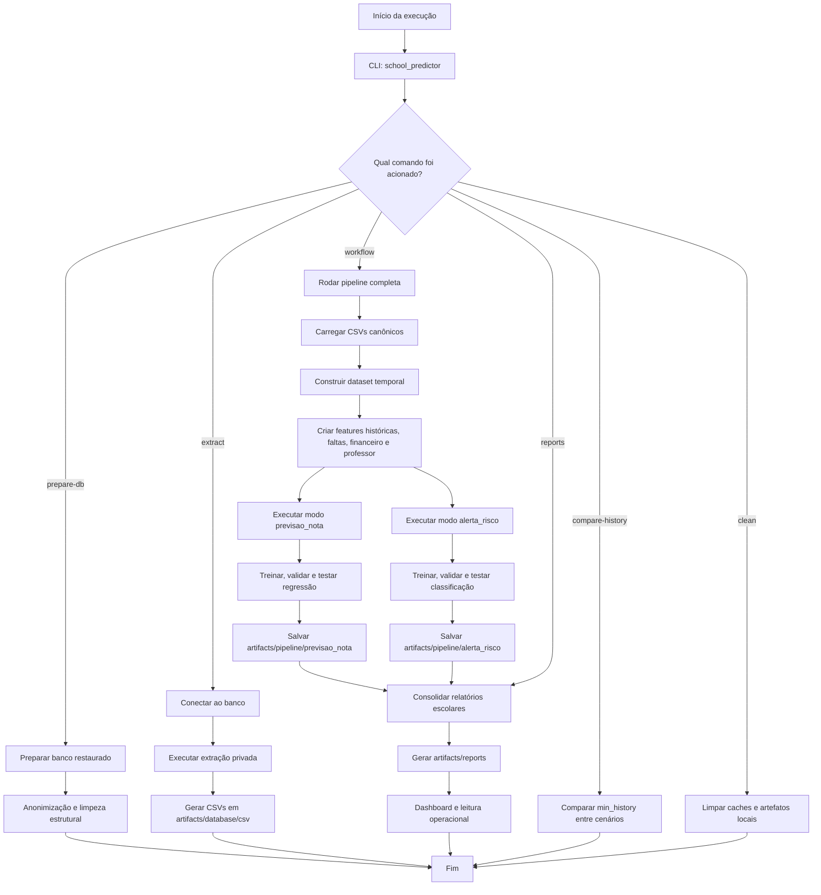

# Fluxo da Pipeline

Este diagrama representa o fluxo operacional principal do projeto, desde a preparação opcional do banco até a geração dos relatórios e o consumo pelo dashboard.

## Leitura rápida

- `prepare-db` atua na base restaurada e é opcional, usado quando o banco é renovado.
- `extract` transforma o banco tratado em CSVs canônicos.
- `workflow` é o fluxo principal do TCC: lê CSVs, modela, avalia e gera relatórios.
- `previsao_nota` e `alerta_risco` nascem a partir do mesmo dataset, mas com objetivos e cortes de histórico diferentes.
- o dashboard consome apenas os relatórios finais, não treina modelos.
