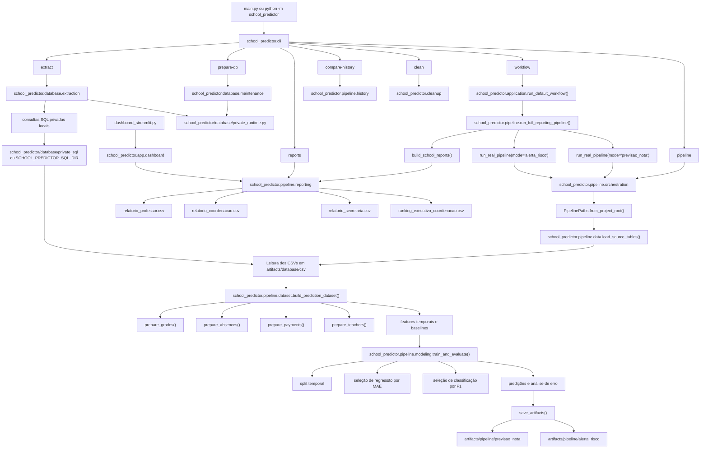

# Diagrama Detalhado da Arquitetura Refatorada

Este diagrama mostra o fluxo principal da aplicação após a reorganização estrutural do projeto.

## Leitura rápida

- `school_predictor/` passou a ser a arquitetura principal do projeto.
- `database/` cuida de banco e extração.
- a execução real de preparação do banco e de extração com tratamento sensível fica em `school_predictor/database/private_runtime.py`, mantido fora do Git.
- as consultas SQL reais de extração ficam fora do Git e são carregadas localmente de `school_predictor/database/private_sql/` ou de um diretório privado equivalente definido por ambiente.
- `pipeline/` cuida de dataset, modelagem e relatórios.
- `cleanup/` cuida da limpeza local de caches e auxiliares de build.
- `app/` cuida do dashboard.
- `artifacts/` passou a ser o diretório canônico de saídas locais da aplicação.
- o código histórico fora do fluxo atual foi removido para manter o projeto focado no caminho operacional do TCC.
