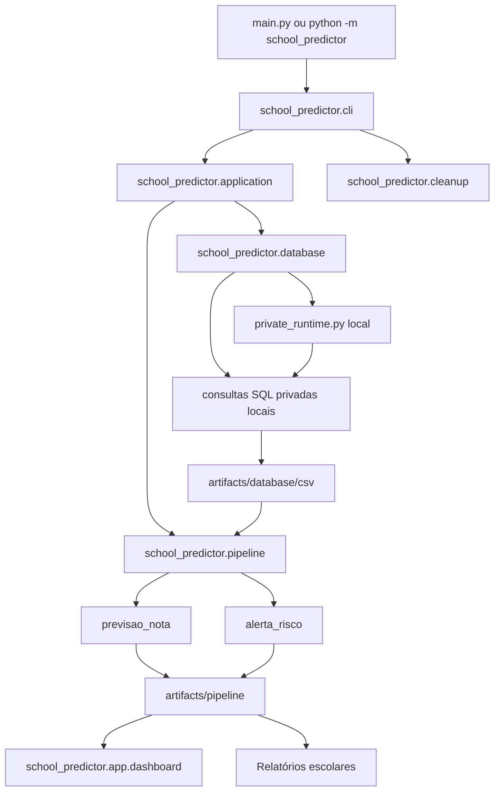

# Diagrama Simples da Arquitetura Atual

Este diagrama resume a arquitetura principal após a consolidação final da refatoração.

```mermaid
flowchart TD
    A["main.py ou python -m school_predictor"] --> B["school_predictor.cli"]
    B --> C["school_predictor.application"]
    B --> C1["school_predictor.cleanup"]
    C --> D["school_predictor.database"]
    C --> E["school_predictor.pipeline"]
    D --> D0["private_runtime.py local"]
    D --> D1["consultas SQL privadas locais"]
    E --> F["previsao_nota"]
    E --> G["alerta_risco"]
    F --> H["artifacts/pipeline"]
    G --> H
    H --> I["school_predictor.app.dashboard"]
    H --> J["Relatórios escolares"]
    D0 --> D1
    D1 --> K["artifacts/database/csv"]
    K --> E
```
