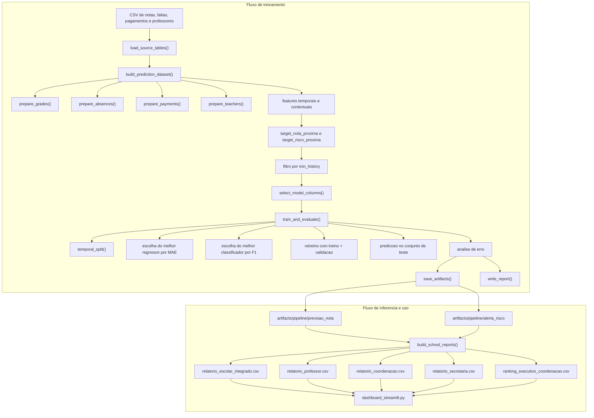

# Diagrama de Fluxo de Treinamento e Inferencia

Este diagrama separa o fluxo em duas partes: treinamento da pipeline e uso do modelo para gerar saídas operacionais.

## Leitura rapida

### Treinamento

- a pipeline comeca lendo os CSVs ja extraidos.
- `build_prediction_dataset()` transforma esses dados em um dataset longitudinal de modelagem.
- nesse dataset sao criadas features historicas, de faltas, de pagamento e de contexto escolar.
- depois sao criados os alvos de previsao de nota e de risco.
- o dataset passa por corte de historico minimo para garantir elegibilidade minima do aluno.
- `train_and_evaluate()` faz split temporal, compara modelos e baselines, escolhe o melhor candidato, retreina e testa.
- os resultados finais sao salvos como dataset, predições, modelo e relatorio tecnico.

### Inferencia e uso

- as saidas dos modos `previsao_nota` e `alerta_risco` sao consolidadas por `build_school_reports()`.
- essa consolidacao gera uma base integrada e relatorios especificos por perfil escolar.
- o dashboard em Streamlit le esses artefatos prontos e apresenta a informacao para consulta.
