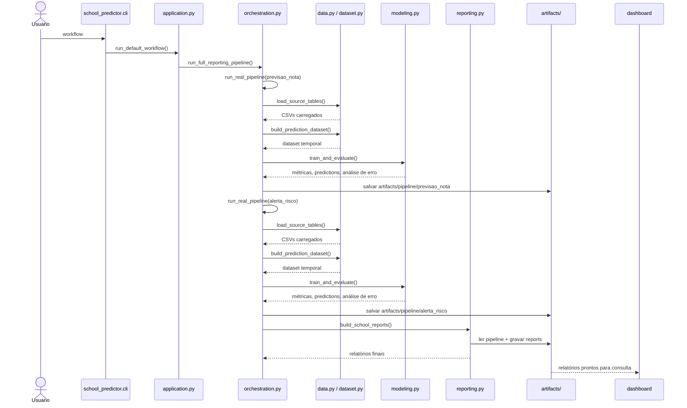

# Sequência Operacional

Este diagrama mostra, em ordem temporal, como uma execução completa do projeto acontece quando o usuário roda o workflow principal.

## Leitura rápida

- a execução principal sempre começa pela CLI.
- os dois modos da pipeline são rodados separadamente dentro do mesmo workflow.
- cada modo produz seus próprios artefatos técnicos.
- os relatórios finais surgem apenas depois que os dois modos terminam.
